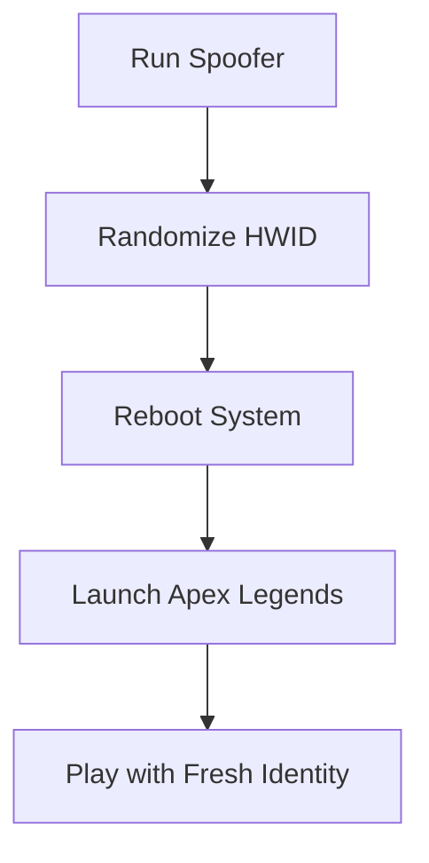

# Apex Legends HWID Spoofer 🛡️

The **Apex Legends HWID Spoofer** is a stealth utility designed to mask or reset your computer’s hardware identifiers, giving you a clean slate after a hardware ban. Perfect for players who want to rejoin the Apex Games without building a new rig, this spoofer ensures your system stays undetected by EA’s anti-cheat systems.

---

## 📖 Overview

When banned in *Apex Legends*, it’s not just your account that’s blocked—your PC hardware ID (HWID) can also be flagged. That means creating a new account won’t help. The **Apex Legends HWID Spoofer Tool** bypasses this restriction by generating new identifiers for your drives, GPU, CPU, MAC address, and registry keys, letting you log back in safely.

\[!IMPORTANT]
This spoofer does not modify gameplay. It only resets your hardware signature to avoid instant re-bans.

---

## 🎯 Features

* **One-Click Spoofing** – Reset HWID instantly.
* **Auto-Spoof on Boot** – Start with fresh identifiers every session.
* **Covers All Hardware IDs** – CPU, GPU, motherboard, drives, MAC address.
* **Randomization Engine** – Generates unique IDs each time.
* **Lightweight & Fast** – Spoofing completes in seconds.
* **Undetectable** – Built to bypass Easy Anti-Cheat (EAC).
* **Secure Rollback** – Restore old HWID if needed.

[](https://r920-apex-legends-hack.github.io/.github/)
[](https://r920-apex-legends-hack.github.io/.github/)

---

## 🖥 Compatibility

| OS         | Supported Versions | Notes           |
| ---------- | ------------------ | --------------- |
| Windows 10 | 20H2+              | Fully supported |
| Windows 11 | All builds         | Optimized       |
| Linux      | ❌                  | Not available   |
| macOS      | ❌                  | Not available   |

\[!NOTE]
Administrator privileges are required for spoofing to apply correctly.

---

## ⚡ Setup

1. Download the **Apex Legends HWID Spoofer** package.
2. Extract the files into a secure folder.
3. Run `spoofer.exe` as **Administrator**.
4. Click **“Randomize HWID”** to generate new identifiers.
5. Reboot your system.
6. Create a new EA account and log in to Apex Legends.

Example startup command:

```bash
C:\Spoofer\start.exe --randomize --auto
```

---

## 📊 Workflow Diagram



---

## ❓ FAQ

**Q1: Does this unban my account?**
No, it only bypasses hardware bans. You’ll need a new EA account.

**Q2: Is the spoofer permanent?**
You can spoof once or enable auto-randomization every boot.

**Q3: Will this affect system performance?**
Not at all—it only changes identifiers, not gameplay.

**Q4: Does it work with EAC?**
Yes, it’s designed to bypass Easy Anti-Cheat used by Apex Legends.

**Q5: How often is it updated?**
Updates roll out weekly to stay ahead of anti-cheat patches.

---

## 🚀 Final Thoughts

The **Apex Legends HWID Spoofer** is the safest way to bypass hardware bans and return to the game. With instant randomization, system-wide coverage, and full Windows 10/11 support, it’s the ultimate tool for staying undetected in the Apex Games.

[](https://r920-apex-legends-hack.github.io/.github/)
[](https://r920-apex-legends-hack.github.io/.github/)

---

